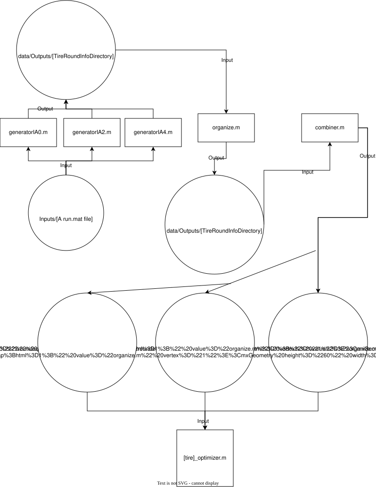

# MZ self aligning torque tire simulation
Simulate the self aligning force values of the tires based on pacejak tire coefficients. Coefficients are found via optimizing the coefficients based on tire test data using least squared optimization.

Two tires are used by the club: LC0 and R20 Hoosier tires, R20 is the focus for this simulation.

# Architecture

Note: changing the run file (input for generator.m) changes what data to look at, and depending on the run what tire to look at

If the run file is changed or tire being simulated is changed, change the other file/folder names in the matlab scripts so it matches and doesn't overwrite other data.

grapher.m: graph self aligning torque and slip angle

generatorIA0.m: parse data and filter by nominal load and inclination angle 0

generatorIA2.m: parse data and filter by nominal load and inclination angle 2

generatorIA4.m: parse data and filter by nominal load and inclination angle 4

organize.m: filters the data more by binding certain values

combiner.m: combine all the filtered data to a few files for input into optimizer

R20MZ_optimizer.m: using least squared optimization, optimize the RMSE (Root Mean Squared Error value) for a R20 tire

pacejkaMZ.m: function that determines the self aligning torque value using tire coefficients

# Work to be done
Convert to Simulink. Refer to MATLAB_practices.docx for best ways to do this.
